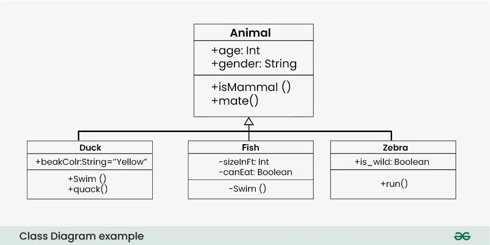

1. Посмотреть различные обнозначения в UML 
    https://www.geeksforgeeks.org/unified-modeling-language-uml-class-diagrams/
2. Попробовать реализовать диаграмму классов
    *опционально, можно не делать*
     
3. Go to File -> Settings -> Plugins
    - тут можно поставить свои плагины
    - есть проблема с установкой PlantUML Integration плагина
    - представление диаграммы можно посмотреть в diagram.puml файле